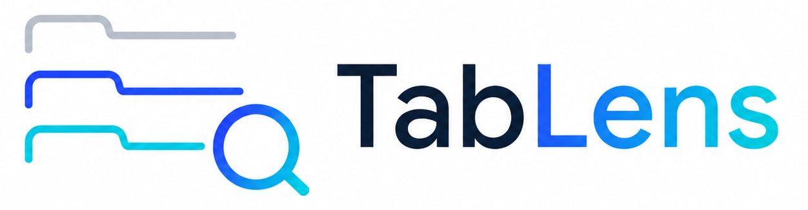
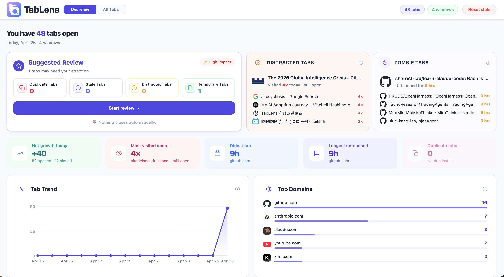
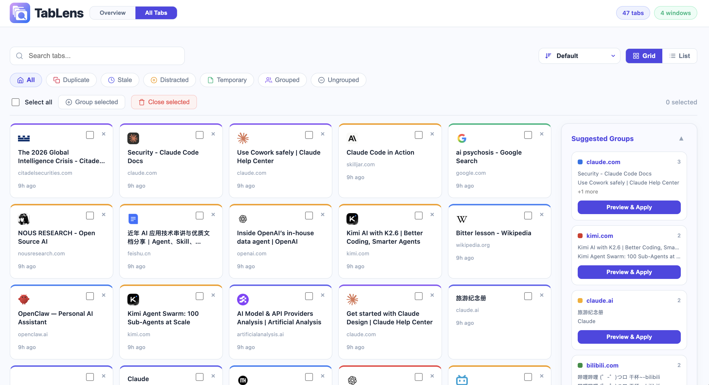

<p align="center">
  
</p>

# TabLens `v0.2.0`

TabLens is a Chrome extension that turns your tab chaos into a clear picture. Instead of hunting through dozens of open tabs, TabLens tracks how you use them — surfacing duplicates, forgotten tabs, and distraction patterns — so you can stay focused and keep your browser lean.

## Table of Contents

- [Screenshots](#screenshots)
- [Features](#features)
  - [Overview Dashboard](#overview-dashboard)
  - [Suggested Review](#suggested-review)
  - [Distracted Tabs](#distracted-tabs)
  - [Zombie Tabs](#zombie-tabs)
  - [All Tabs View](#all-tabs-view)
  - [Smart Grouping](#smart-grouping)
- [Install](#install)
- [Project Structure](#project-structure)
- [Develop](#develop)
- [License](#license)

## Screenshots

### Overview Dashboard

<p align="center">
  
</p>

### All Tabs View

<p align="center">
  
</p>

## Features

### Overview Dashboard

A bird's-eye view of your browser health at a glance.

- **Tab & window count** — Live badge showing total open tabs across all windows
- **Net growth today** — How many tabs you've opened vs. closed today
- **Most visited open tab** — The tab you return to most, with visit count
- **Oldest tab** — The tab that's been sitting open the longest
- **Longest untouched** — The tab with the most time since your last visit
- **Duplicate tabs** — Clickable count of exact URL duplicates, ready to clean up
- **Tab Trend chart** — 14-day daily snapshot showing how your tab count changes over time
- **Top Domains** — Ranked list of the most common domains across all your open tabs

### Suggested Review

The smartest part of TabLens. One click surfaces every tab worth reconsidering, organized into four categories:

| Category | What it means |
|---|---|
| **Duplicate Tabs** | Exact URL matches open more than once |
| **Stale Tabs** | Tabs you haven't touched in a long time |
| **Distracted Tabs** | Tabs you switch to too frequently — potential focus killers |
| **Temporary Tabs** | Tabs that look like one-off reads or downloads |

Nothing closes automatically. TabLens only shows you what to consider — you decide what to close.

### Distracted Tabs

Tabs ranked by how often you switch to them. A high visit count means you're context-switching to that tab repeatedly, which is worth noticing.

### Zombie Tabs

Tabs that have been open for 1+ hours with no activity in the last 3+ hours. These are the forgotten survivors — open in theory, invisible in practice.

### All Tabs View

Full control over every tab in one place.

- **Search** — Filter tabs by title or URL in real time
- **Sort** — Order by default, most/least recently visited, or newest/oldest opened
- **Grid or list layout** — Toggle between card grid and compact list view
- **Quick filters** — One-click filters for All, Duplicate, Stale, Distracted, Temporary, Grouped, and Ungrouped tabs
- **Batch selection** — Select all or pick individual tabs, then group or close them in one action
- **Undo close** — Accidentally closed a tab? Undo it before it's gone

### Smart Grouping

TabLens analyzes your open tabs by domain and keywords, then suggests logical groups. Each suggestion shows which tabs would be grouped and lets you preview before applying. You can also select tabs manually and group them in one click.

## Install

1. Clone or download this repo
2. Open Chrome → `chrome://extensions/`
3. Enable **Developer mode** (top right toggle)
4. Click **Load unpacked** and select the project folder
5. Open a new tab and click the TabLens icon in your toolbar

## Project Structure

```
├── src/
│   ├── background.js      # Service worker — tracks tab events & runs periodic alarms
│   ├── manager.html       # Main dashboard UI
│   ├── manager.js         # Dashboard logic & rendering
│   ├── manager.css        # Dashboard styles
│   ├── grouping.js        # Smart tab grouping engine
│   ├── stats.js           # Tab statistics & analytics
│   └── tabData.js         # Tab data models & helpers
├── tests/                 # Jest unit tests
├── assets/                # Icons & logos
├── manifest.json          # Chrome extension manifest v3
└── config/jest.config.js  # Test configuration
```

## Develop

```bash
npm install
npm test
```

After making changes to source files, reload the extension at `chrome://extensions/` by clicking the refresh icon on the TabLens card.

### Tech Stack

- **Manifest V3** Chrome Extension
- Vanilla JavaScript — no framework dependencies
- Jest for unit testing

## License

MIT
